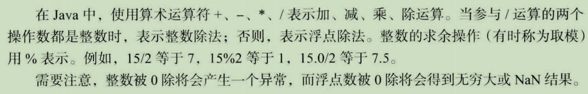
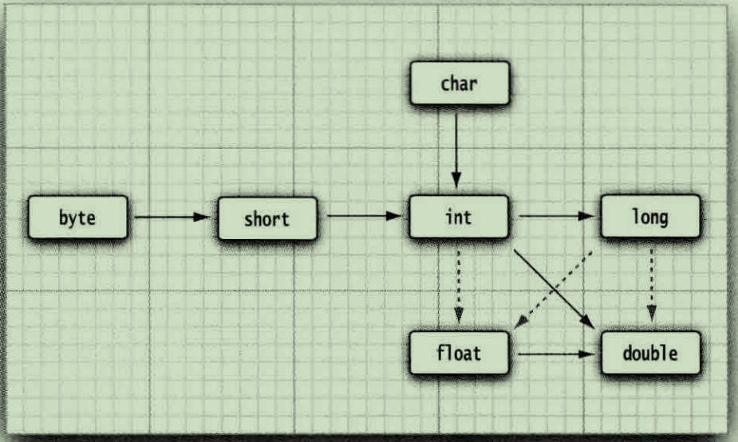
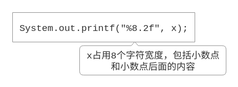
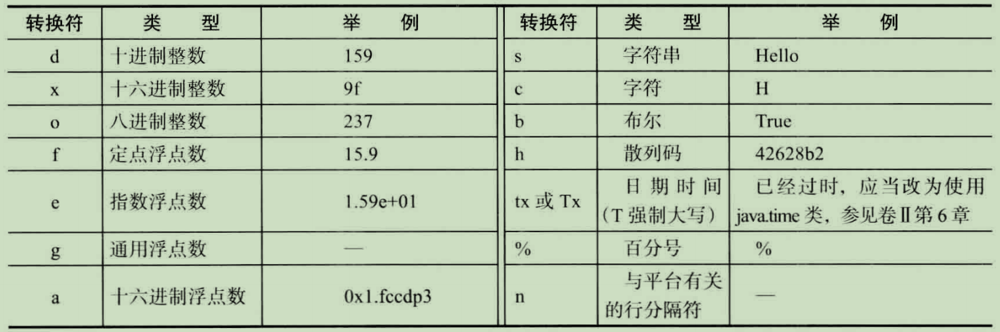
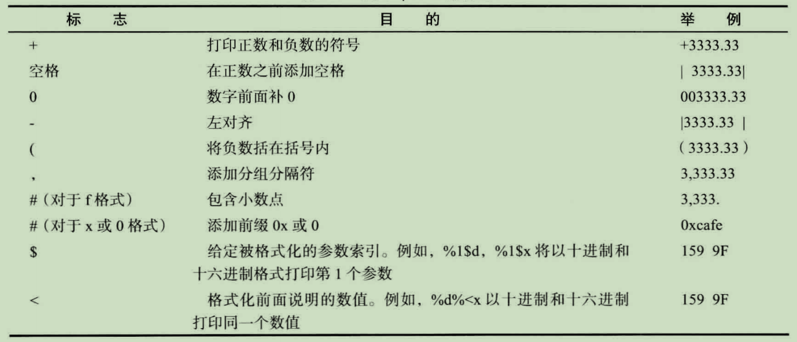
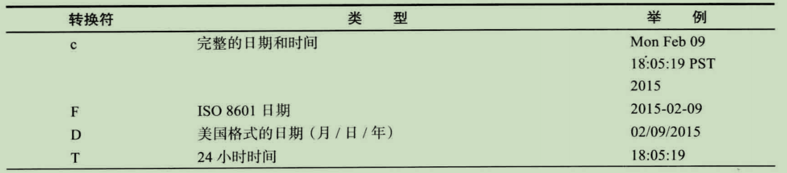
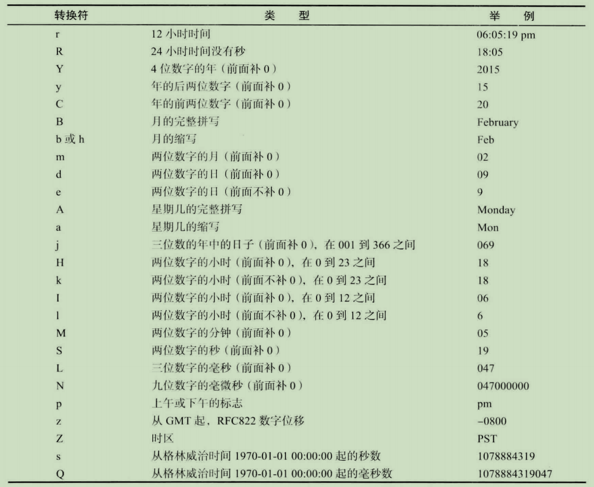
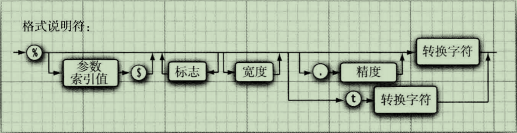

# Java变量

[TOC]


## 命名规则

略

判断一个标识符的方法

* 判断是否可以标识符的首字符

    `Character.isJavaIdentifierStart('a')`

* 判断是否可以用作标识符

    `Character.isJavaIdentifierPart('a')`


>尽管`$`是一个合法的Java字符，但不要在自己的代码中使用这个字符。它只用在Java编译器或其他工具生成的名字中。

## 变量初始化

声明一个变量之后，必须用赋值语句对变量进行显式初始化，千万不要使用未初始化的变量。

```java
int vacationDays;
System.out.println(vacationDays);
```

在Java中，变量的声明尽可能地靠近变量第一次使用的地方，这是一种良好的程序编写风格。

> * C++注释：声明和定义的区别
>
>     ```cpp
>     int i = 10; // 定义
>     extern int i; // 声明
>     ```
>
>     在Java中，不区分声明与定义。

## 常量(final)

```java
public static void main(String[] args) {
    final int SIZE = 512;
}
```

关键字final表示这个变量只能被赋值一次。一旦被赋值之后，就不能够再更改了。习惯上，常量名使用全大写。

---

在Java中，经常希望某个常量可以在一个类中的多个方法中使用，通常将这些常量称为类常量。可以使用关键字`static final`设置一个类常量。

```java
# Math.java
public static final double E = 2.7182818284590452354;
public static final double PI = 3.14159265358979323846;
```

> * C++注释：`const`是Java保留的关键字，但目前并没有使用。在Java中，必须使用`final`定义常量。

---

# 运算符



## Math

向下取整

```java
# public static double floor(double a);
public static void main(String[] args) {
    System.out.println((int) Math.floor(3.14));
    System.out.println((int) Math.floor(-3.14));
}
```

```txt
3
-4
```

## 数值之间的转换



上图中的实线部分类型转换不会有精度缺失，虚线部分会有精度缺失。

## 强制类型转换

```JAVA
public static void main(String[] args) {
    double x = 9.997;
    int nx = (int) x; // 9
    int rnx = (int) Math.round(x); // 10
}
```

`double`转成`int`只是把整数部分转换。

如果要四舍五入则需要`Math.round(x)`转换。

>* 警告：如果试图将一个数值从一种类型强制转换为另一种类型，而又超出了目标类型的表示范围，结果就会截断成一个完全不同的值。例如，(byte)300的实际值为44。
>* C++注释：不要在boolean类型与任何数值类型之间进行强制类型转换，这样可以防止发生错误。只有极少数情况才需要将布尔类型转换为数值类型，这时可以使用条件表达式`b ? 1 : 0`

&&和||运算符是按照“短路”方式来求值的：

如果地一个操作书已经能够确定表达式的值，第二个操作数就不必计算了。

+ exp1 && exp2 

    when exp1 is false,  return false.won't execute exp2.

+ exp2 || exp2

    when exp1 is true, return true.won't execute exp2.

### 移位运算符<<、>>、>>>

* 注意：不存在`<<<`运算符

`<<`向左移位，用0填充

`>>`向右移位，当数字为正数时用0填充，当数字为负数时用1填充

`>>>`逻辑向右移位，用0填充

> + 警告：以为运算符的右操作数要完成模32的运算（除非左操作数是long类型，在这种情况下需要对右操作书模64）
>
>     ```JAVA
>     public static void main(String[] args) {
>         System.out.println(2 << 35); // 16
>         System.out.println(2L << 35); // 68719476736
>     }
>     ```
>
>     懂？

### 枚举类型

简单举例

```JAVA
public class MainApp {
    enum Size{SMALL, MEDIUM, LARGE, EXTRA_LARGE};
    public static void main(String[] args) {
        Size s1 = Size.SMALL;
        Size s2 = null;
        System.out.println(s1); // SMALL
        System.out.println(s2); // null
    }
}
```

## 字符串

### 子串

> `public String substring(int beginIndex, int endIndex);`

```JAVA
String greeting = "Hello";
String s = greeting.substring(0, 3); // "Hel"
```

### 拼接

+ 用`+`拼接
+ `String.join(delimiter, elements)`

```JAVA
public static void main(String[] args) {
    String str1 = "Hello ";
    String str2 = "World";
    String hello = str1 + str2;
    System.out.println(hello); // "Hello World"
    String awsl = String.join(" ", "A", "W", "S", "L");
    System.out.println(awsl); // "A W S L"
}
```

> `+`拼接字符串跟底层有关
>
> `public static String join(CharSequence delimiter, CharSequence... elements)`
>
> join方法拼接字符串需要有分割符

### 不可变字符串

String类没有提供用于修改字符串的方法。

在Java文档中将String类对象称为不可变字符串。

不可变字符串有一个有点：编译器可以让字符串共享。

### 检测字符串是否相等

+ 区分大小写`“hello".equals("world");`
+ 不区分大小写`"hello".equalsIgnoreCase("hello");`

> C++注释：C++的string类重载了==运算符；Java不支持重载运算符。
>
> C程序员通过`strcmp`函数比较字符串，Java的`compareTo`方法与`strcmp`类似
>
> `if(greeting.compareTo("Hello") == 0)...`
>
> 但是`equals`更好看、更清晰

### 空字符串与null

判断一个字符串是否为空：

```JAVA
if (str.length() == )
// 或者
if (str.equals(""))
```

null表示目前没有任何对象与该变量关联

检查一个字符串是否为null

```JAVA
if (str == null)
```

有时要检查一个字符串既不是null也不为空字符串，这种情况下需要使用一下条件

```JAVA
if (str != null && str.length() != 0)
```

### 码点与代码单元


`char`数据类型是一个采用UTF-16编码表示Unicode码点的代码单元[^Java码点与代码单元]。

+ 码点(code point)是指与一个编码表中的某个字符对应的代码值.
+ 代码单元一个char类型数据，或者说代码单元 是字符。

大多数的常用Unicode字符使用一个代码单元就可以表示,而辅助字符需要一对代码单元表示.  


length方法将返回采用UTF-16编码表示的给定字符串所需要的代码单元数.

```JAVA
String greeting = "Hello";
int n = greeting.length(); // 5
```

如果要想得到一个字符串的码点数量,可以调用

```JAVA
int codePoindCount = greeting.codePointCount(0, greeting.length());
```

> 扩展:
>
> 调用s.charAt(n)将返回位置n的代码单元
>
> ```java
> char first = greeting.charAt(0); // first is 'H'
> char last = greeting.charAt(4); // last is 'o'
> ```
>
> 如果想要得到第n个码点,应该使用下列语句
>
> ```
> int index = greeting.offsetByCodePoints(0, n);
> int codePoint = greeting.codePointAt(index);
> ```
>
> 

### String API

| 方法                                                         | 说明                                                         |
| :----------------------------------------------------------- | :----------------------------------------------------------- |
| char charAt(int index);                                      | 返回给定位置的代码单元(char)                                 |
| int codePointAt(int index);                                  | 返回给定位置的码点                                           |
| int offsetByCodePoints(int startIndex, int cpCount);         | 返回从startIndex代码点开始,位移cpCount后的码点索引           |
| int compareTo(String other);                                 | 按照字典顺序,如果字符串位于other之前,返回一个负数;如果字符串位于other之后,返回一个正数;如果两个字符串相等,返回0. |
| IntStream codePoints();                                      | 将这个字n 符串的码点作为一个流返回.调用toArray将他们放在一个数组中. |
| new String(int[] codePoints, int offset, int count);         | 用数组中从offset开始的count个码点构造一个字符串.             |
| boolean equals(Object other);                                | 如果字符串与other相等,返回true.                              |
| boolean equalsIgnoreCase(String other);                      | 如果字符串与other相等(忽略大小写),返回true.                  |
| boolean startsWith(String perfix);                           | 如果字符串以prefix开头,则返回true.                           |
| boolean endsWith(String suffix);                             | 如果字符串以suffix结尾,则返回true.                           |
| int indexOf(String str)                                      | 返回与字符串str或代码点cp匹配的第一个                        |
| int indexOf(String str, int formIndex);                      | 子串的开始位置.这个位置从索引0或                             |
| int indexOf(int cp);                                         | fromIndex开始计算.如果在原始串中不存在                       |
| int indexOf(int cp, int fromIndex);                          | str,返回-1.                                                  |
| int lastIndexOf(String str);                                 | 返回与字符串str或代码点cp匹配的最后一个                      |
| int lastIndexOf(String str, int fromIndex);                  | 子串的开始位置.这个位置从原始串尾端或                        |
| int lastIndexOf(int cp);                                     | fromIndex开始计算.                                           |
| int lastIndexOf(int cp, int fromIndex);                      |                                                              |
| int length();                                                | 返回字符串的长度                                             |
| int codePointCount(int startIndex, int endIndex);            | 返回startIndex和endIndex-1之间的代码点数量.没有配成对的代用字符将计入代码点. |
| String replace(CharSequence oldString, CharSequence newString); | 返回一个新字符串.这个字符串用newString代替原始字符串中所有的oldString.可以用String或StringBuilder对象作为CharSequence参数. |
| String substring(int beginIndex);                            | 返回一个新字符串.这个字符串包含原始字符                      |
| String substring(int beginIndex, int endIndex);              | 串中从beginIndex到串尾或endIndex-1的所有代码单元             |
| String toLowerCase();                                        | 小写                                                         |
| String toUpperCase();                                        | 大写                                                         |
| String trim();                                               | 返回一个新字符串.这个字符串将删除原始字符串头部和尾部的空格. |
| String join(CharSequence delimiter, CharSequence... elements); | 返回一个新字符串,用给定的定界符连接所有元素.                 |
|||

### 构建字符串(StringBuilder)

```JAVA
StringBuilder builder = new StringBuilder();
builder.append(ch); // append a single character
builder.append(str); // append a string
String completedString = builder.toString();
```

> 注释:在JDK5.0中引入StringBuilder类.这个类的前身是StringBuffer,其效率稍有些低,但允许采用多线程的方式执行添加或删除字符串的操作.如果所有字符串在一个单线程中编程(通常都是这样),则因该用StringBuilder替代它.这两个类的API是相同的.

| __     | StringBuilder | StringBuffer |
| ------ | ------------- | :----------: |
| 效率   | 相对高        |    相对低    |
| 多线程 | 不可以        |     可以     |

API:

| 方法                                               | 说明                                                    |
| -------------------------------------------------- | ------------------------------------------------------- |
| StringBuilder()                                    | 构造一个空的字符串构建器                                |
| int lenth()                                        | 返回构建器或缓冲器中的代码单元数量                      |
| StringBuilder append(String str)                   | 追加一个字符串并返回this                                |
| StringBuilder append(char c)                       | 追加一个代码但会员并返回this                            |
| StringBuilder appendCodePoint(int cp)              | 追加一个代码点,并将其转换为一个或两个代码单元并返回this |
| void setCharAt(int i, char c);                     | 将第i个代码单元设置为c                                  |
| StringBuilder insert(int offset, String str)       | 在offset位置插入一个字符串并返回this                    |
| StringBuilder insert(int offset, char c)           | 在offset位置插入一个代码单元并返回this                  |
| StringBuilder delete(int startIndex, int endIndex) | 删除偏移量从startIndex到endIndex-1的代码单元并返回this  |

## 输入输出

java的标准输出流(控制台窗口)

`System.out.println`

标准输入流,需要先构造一个Scanner对象.

`Scanner in = new Scanner(System.in);`

`in.next();`下一个单词

`in.nextLine();`下一行

`in.nextInt();`下一个整数

```JAVA
import java.util.Scanner;

public class Main {
    public static void main(String[] args) {
        Scanner in = new Scanner(System.in);

        System.out.print("What is your name? ");
        String name = in.nextLine();

        System.out.print("How old are you? ");
        int age = in.nextInt();

        System.out.println("Hello, " + name + ". Next year, you'll be " +(age + 1));
    }
}
```

> **注释**:因为输入时可见的,所以Scanner类不适用与从控制台读取密码.Java SE 6特别引入了Console类实现这个目的.要想读取一个密码,可以采用下列代码:
>
> ```java
> public class MainApp {
>     public static void main(String[] args) {
>         Console console = System.console();
>         if (console == null) {
>             System.out.println("ERROR console == null !!!");
>             System.exit(1);
>         }
>         String name = console.readLine("User name: ");
>         char[] passwd = console.readPassword("Mr/Miss %s Please input your pass word: ", name);
> 
>         System.out.printf("USER NAME [%s]%n", name);
>         System.out.printf("PASS WORD [%s]%n", new String(passwd));
>     }
> }
> ```
>
> 注意如果没有可交互的控制台,System.console()方法将会返回null.

### Scanner

| 方法                    | 说明                                         |
| ----------------------- | -------------------------------------------- |
| Scanner(InputStream in) | 用给定的输入流创建一个Scanner对象            |
| String nextLine()       | 读取输入的下一行内容                         |
| String next()           | 读取输入的下一个单词(以空格作为分隔符)       |
| int nextInt()           | 读取并转换下一个表示整数的字符序列           |
| int nextDouble()        | 读取并转换下一个表示浮点数的字符序列         |
| boolean hasNext()       | 检测输入中是否还有其他单词                   |
| boolean hasNextInt()    | 检测输入中是否还有表示整数的下一个字符序列   |
| boolean hasNextDouble() | 检测输入中是否还有表示浮点数的下一个字符序列 |

### System

`static Console console();`

> 如果有可能进行交互操作,通过控制台窗口为交互的用户返回一个Console对象,否则返回null.对于任何一个通过控制台窗口启动的程序,都可以使用Consoel对象.否则,其可用性将与使用的系统有关.
>
> 说人话就是用了这个,程序要在控制台终端中运行.

### Console

`static char[] readPassword(String prompt, Object... args)`

`static String readLine(String prompt, Object... args)`

 显示字符串prompt并且读取用户输入,知道输入行结束.args参数可以用来提供输入格式.

Console类的方法只能按行读取.

### 格式化输出





printf还支持很多种格式化输出，如下图。



printf还支持各种标识符




> **注释**：可以使用`%s`转换符格式化任意的对象。对于任意实现了Formattable接口的对象都将调用formatTo方法；否则将调用toString方法，他可以将对象转换为字符串。


后续

一些时间格式化的转换符






关于printf的格式说明符




### 文件输入与输出


# 参考

[^Java码点与代码单元]: https://www.cnblogs.com/huaranmeng/p/12774984.html